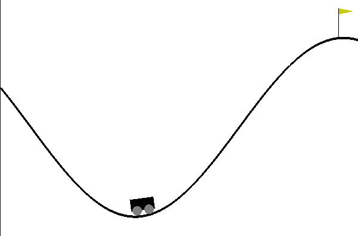

# DQN-Family

Comparison DQN variations with pytorch. 
MountainCar-v0 is used for experiment.

# Requirement
* pytorch
* gym
* tensorboard
* numpy

# Mountain Car

Rewards per episodes training.

DQN: Orange

Double DQN: Blue

# Mountain Car

Rewards per episodes training.

DQN: Blue

Double DQN: Pink

# TODO
- [x] DQN
- [x] Double DQN
- [ ] Dueling DQN
- [ ] Dueling Double DQN
