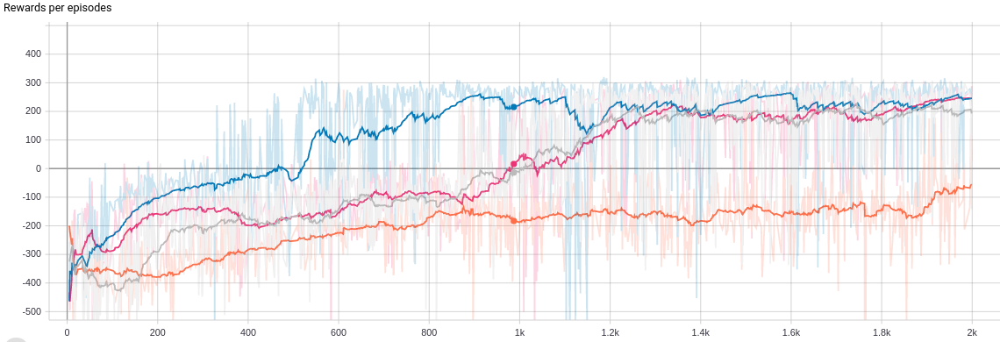

# DQN-Family

Comparison DQN variations with pytorch. 
MountainCar-v0, LunarLander-v2 is used for experiment.

# Requirement
* pytorch
* gym
* tensorboard
* numpy

# Mountain Car

Rewards per episodes training.

DQN: Orange

Double DQN: Blue

# LunarLander

Rewards per episodes training.

DQN: Orange

Double DQN: Blue

Dueling DQN: Pink

D3QN: Silver

# TODO
- [x] DQN
- [x] Double DQN
- [x] Dueling DQN
- [x] Dueling Double DQN
- [ ] PER
- [ ] NoiseNet
- [ ] C51
- [ ] Rainbow
- [ ] CNN